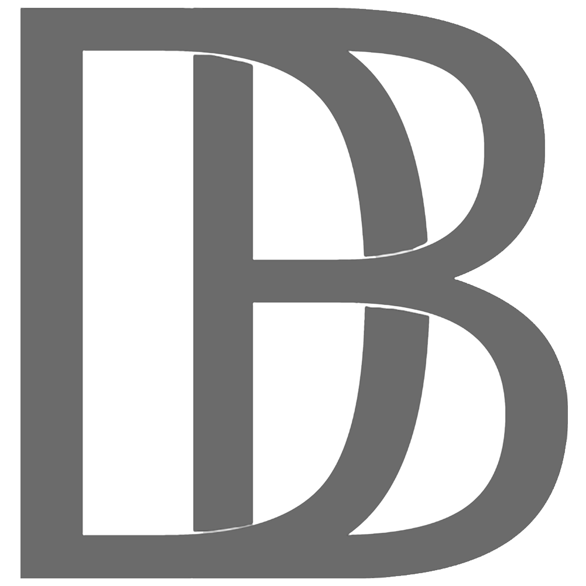

<div id="top"></div>

<!-- PROJECT SHIELDS -->
[![Contributors][contributors-shield]][contributors-url]
[![Forks][forks-shield]][forks-url]
[![Stargazers][stars-shield]][stars-url]
[![Issues][issues-shield]][issues-url]
[![MIT License][license-shield]][license-url]
[![LinkedIn][linkedin-shield]][linkedin-url]

<!-- PROJECT LOGO -->
<br />
<div align="center">
  <a href="https://github.com/brookton/next-dark-mode">
    
  </a>

<h3 align="center">Next JS with Dark Mode</h3>

  <p align="center">
    A simple, no fuss, single dependency dark mode
    <br />
    <a href="https://github.com/brookton/next-dark-mode"><strong>Explore the docs »</strong></a>
    <br />
    <br />
    <a href="https://next-dark-mode-nu.vercel.app">View Demo</a>
    ·
    <a href="https://github.com/brookton/next-dark-mode/issues">Report Bug</a>
    ·
    <a href="https://github.com/brookton/next-dark-mode/issues">Request Feature</a>
  </p>
</div>

<!-- TABLE OF CONTENTS -->
<details>
  <summary>Table of Contents</summary>
  <ol>
    <li>
      <a href="#about-the-project">About The Project</a>
      <ul>
        <li><a href="#built-with">Built With</a></li>
      </ul>
    </li>
    <li>
      <a href="#getting-started">Getting Started</a>
      <ul>
        <li><a href="#prerequisites">Prerequisites</a></li>
        <li><a href="#installation">Installation</a></li>
      </ul>
    </li>
    <li><a href="#usage">Usage</a></li>
    <li><a href="#roadmap">Roadmap</a></li>
    <li><a href="#contributing">Contributing</a></li>
    <li><a href="#license">License</a></li>
    <li><a href="#contact">Contact</a></li>
    <li><a href="#acknowledgments">Acknowledgments</a></li>
  </ol>
</details>

<!-- ABOUT THE PROJECT -->
## About The Project


I wanted to create a simple solution for implementing dark mode in Next JS with minimal dependencies. This leverages a custom hook, named `darkmode` to read the system's preference, and update the app depending on if dark mode changes on the viewer's platform.

<p align="right">(<a href="#top">back to top</a>)</p>

### Built With

* [Next.js](https://nextjs.org/)
* [styled-components](https://styled-components.com)

<p align="right">(<a href="#top">back to top</a>)</p>

<!-- GETTING STARTED -->
## Getting Started

To get a local copy up and running follow these simple steps.

### Prerequisites

This is an example of how to list things you need to use the software and how to install them.
* npm
  ```sh
  npm install npm@latest -g
  ```

### Installation

1.  Clone the repo
   ```sh
   git clone https://github.com/brookton/next-dark-mode.git
   ```
2. Install packages
   ```sh
   yarn
   ```
3. Run the app
   ```sh
   yarn dev
   ```

<p align="right">(<a href="#top">back to top</a>)</p>

<!-- USAGE EXAMPLES -->
## Usage

This application serves as a nice base to build a NextJS application off of. You can use it locally to begin development or to learn more about Next JS or `styled-components`. 

_For more examples, please refer to the [Documentation](https://github.com/brookton/next-dark-mode)_

<p align="right">(<a href="#top">back to top</a>)</p>

<!-- ROADMAP -->
## Roadmap

- [ ] Refactoring to Typescript
- [ ] Styling refactoring
- [ ] Optimizing application
    - [ ] SEO

See the [open issues](https://github.com/brookton/next-dark-mode/issues) for a full list of proposed features (and known issues).

<p align="right">(<a href="#top">back to top</a>)</p>

<!-- CONTRIBUTING -->
## Contributing

Contributions are what make the open source community such an amazing place to learn, inspire, and create. Any contributions you make are **greatly appreciated**.

If you have a suggestion that would make this better, please fork the repo and create a pull request. You can also simply open an issue with the tag "enhancement".
Don't forget to give the project a star! Thanks again!

1. Fork the Project
2. Create your Feature Branch (`git checkout -b feature/AmazingFeature`)
3. Commit your Changes (`git commit -m 'Add some AmazingFeature'`)
4. Push to the Branch (`git push origin feature/AmazingFeature`)
5. Open a Pull Request

<p align="right">(<a href="#top">back to top</a>)</p>

<!-- LICENSE -->
## License

Distributed under the MIT License. See `LICENSE.txt` for more information.

<p align="right">(<a href="#top">back to top</a>)</p>

<!-- CONTACT -->
## Contact

David Brookton - [@davidbrookton](https://twitter.com/brookton)

Project Link: [https://github.com/brookton/next-dark-mode](https://github.com/brookton/next-dark-mode)

<p align="right">(<a href="#top">back to top</a>)</p>

<!-- ACKNOWLEDGMENTS -->
## Acknowledgments

* [Verecel](https://verecel.com)
* [Next JS](https://nextjs.org)
* [Styled Components](https://styled-components.com)

<p align="right">(<a href="#top">back to top</a>)</p>

<!-- MARKDOWN LINKS & IMAGES -->
<!-- https://www.markdownguide.org/basic-syntax/#reference-style-links -->
[contributors-shield]: https://img.shields.io/github/contributors/brookton/next-dark-mode.svg?style=for-the-badge
[contributors-url]: https://github.com/brookton/next-dark-modegraphs/contributors
[forks-shield]: https://img.shields.io/github/forks/brookton/next-dark-mode.svg?style=for-the-badge
[forks-url]: https://github.com/brookton/next-dark-mode/network/members
[stars-shield]: https://img.shields.io/github/stars/brookton/next-dark-mode.svg?style=for-the-badge
[stars-url]: https://github.com/brookton/next-dark-mode/stargazers
[issues-shield]: https://img.shields.io/github/issues/brookton/next-dark-mode.svg?style=for-the-badge
[issues-url]: https://github.com/brookton/next-dark-mode/issues
[license-shield]: https://img.shields.io/github/license/brookton/next-dark-mode.svg?style=for-the-badge
[license-url]: https://github.com/brookton/next-dark-mode/blob/master/LICENSE.txt
[linkedin-shield]: https://img.shields.io/badge/-LinkedIn-black.svg?style=for-the-badge&logo=linkedin&colorB=555
[linkedin-url]: https://linkedin.com/in/davidbrookton
[product-screenshot]: images/screenshot.png
